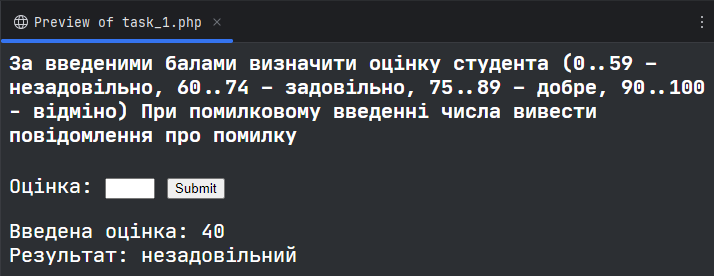
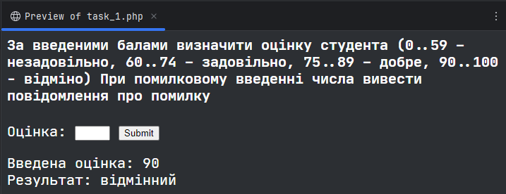
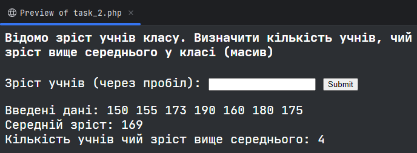
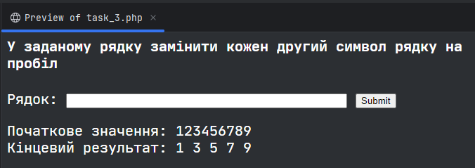

# Контрольна робота
### Жеревчук Сергій, 34 група
### Варіант 4

## 1. За введеними балами визначити оцінку студента (0..59 – незадовільно, 60..74 – задовільно, 75..89 – добре, 90..100 - відміно) При помилковому введенні числа вивести повідомлення про помилку
[Повний код](/src/task_1.php)

Основний код:
```php
<?php
    // Функція яка обробляє оцінку
    function check_grade($grade)
    {
        if ($grade < 0 || $grade > 100) {
            return "Оцінка за межами діапазону";
        }
        
        if ($grade <= 59) {
            return "незадовільний";
        }
        
        if ($grade <= 74) {
            return "задовільний";
        }
        
        if ($grade <= 89) {
            return "добрий";
        }
        
        return "відмінний";
    }

    // Обробка відправки форми
    if ($_SERVER["REQUEST_METHOD"] == "POST") {
        $grade = isset($_POST["grade"]) ? (int)$_POST["grade"] : -1;
        
        echo "Введена оцінка: $grade <br>Результат: " . check_grade($grade);
    }
```

Результати виконання:




## 2. Відомо зріст учнів класу. Визначити кількість учнів, чий зріст вище середнього у класі (масив)
[Повний код](/src/task_2.php)

Основний код:
```php
<?php
    // Обчислює середнє значення в масиві
    function average($array)
    {
        return array_sum($array) / count($array);
    }
    
    // Обробка відправки форми
    if ($_SERVER["REQUEST_METHOD"] == "POST") {
        $raw_data = isset($_POST["data"]) ? $_POST["data"] : "";
        $data = explode(" ", $raw_data);

        // Валідація даних
        if ($raw_data == "") {
            echo "Данні введені не вірно";
            return;
        }

        // Підрахунок середнього значення
        $average = average($data);
        $count = 0;
        
        echo "Введені дані: $raw_data <br>";
        echo "Середній зріст: $average <br>";

        // Підрахунок кількості значень які більші за середнє
        foreach ($data as $value) {
            if ((int)$value > $average) {
                $count++;
            }
        }
        
        echo "Кількість учнів чий зріст вище середнього: $count";
    }
```

Результат виконання:



## 3. У заданому рядку замінити кожен другий символ рядку на пробіл
[Повний код](/src/task_3.php)

Основний код:
```php
<?php    
    // Обробка відправки форми
    if ($_SERVER["REQUEST_METHOD"] == "POST") {
        $data = isset($_POST["data"]) ? $_POST["data"] : "";
        
        echo "Початкове значення: $data <br>";
        
        // Заміна кожного другого символу на пробіл
        for ($i = 1; $i < strlen($data); $i += 2) {
            $data[$i] = " ";
        }
        
        echo "Кінцевий результат: $data";
    }
```

Результат виконання:

